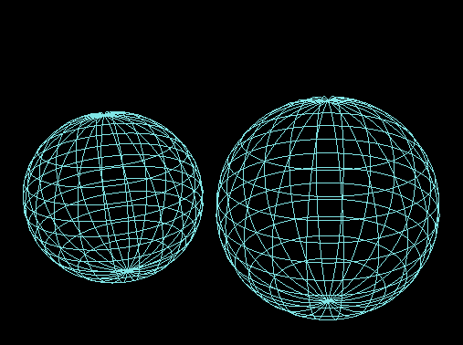
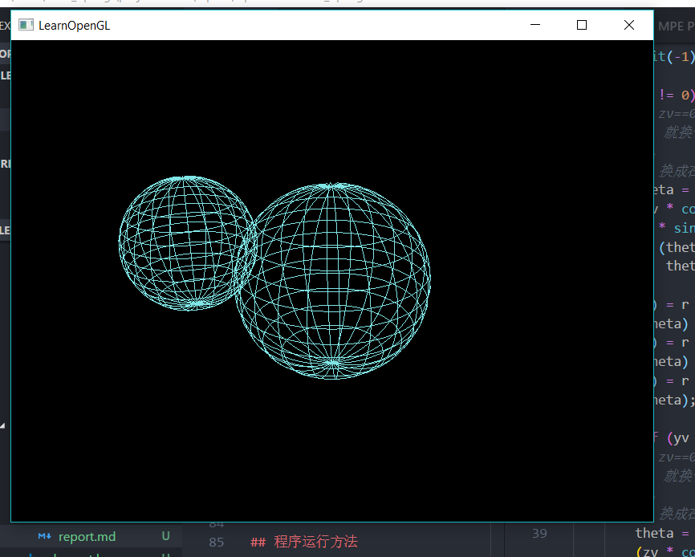
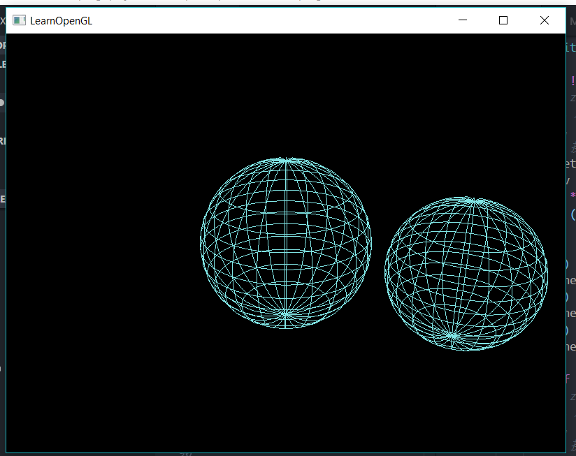

# 计算机图形学 HW3 报告

[TOC]

## 开发环境

本作业的开发环境是window+mingw。
基于GLFW第三方库进行窗口管理，并使用了GLM数学库用于矩阵运算。

## 程序实现说明

### 概述

由于本程序在OPENGL核心模式下进行编程，因此实现的方法有一些复杂，下面解释一下程序的细节。


### 关键函数 get_v_vector

该函数的用处是：在三维坐标系中，找到与一个向量垂直的所有向量（该向量默认在原点处），具体的代码实现可见`element.h`

#### 细节

对于起点都在原点的向量$v0 = (xv,yv,zv)$，如何找到尽可能多的向量$v = (x,y,z)$，并且v0 与 v 垂直呢？

首先，进行坐标系的转换，使用球坐标系进行计算：

$$ x = r * sin(\theta) * cos(\phi) $$ 
$$ y = r * sin(\theta) * cos(\phi) $$ 
$$ z = r * cos(\theta) $$ 

然后，根据垂直条件，可知

$$ xv * x + yv * y + zv * z = 0 $$

两式联立可解得$\theta$，将$\theta$和$\phi$代入原式即可解得$x,y,z$。

$$ tan(\theta) = \frac{-zv}{xv * cos(\phi) + yz * sin(\phi)} $$

又由于$\phi$的范围为$0 - 2\pi$,因此可通过对$\phi$的迭代来获得尽可能多的长度为$r$且与向量$v0$垂直的向量，就找到了圆上的点。

```cpp
// zv不等于0，那就在xy平面上画
theta = atan((-zv)/(xv * cos(fai) + yv * sin(fai)));
if (theta < 0){
    theta += PI;
}
(x) = r * sin(theta) * cos(fai);
(y) = r * sin(theta) * sin(fai);
(z) = r * cos(theta);
```

具体还有一些细节需要处理，如反三角函数计算$\theta$的时候需要判断正负，还有一些使分母为0的情况，在代码中都已经处理了。这里就不在赘述

#### 作用

在三个地方用到了它：

1. 画圆的时候，使用圆的法向量定位圆的方向，通过该函数找到圆上的点，从而连线成圆。
1. 画经线的时候，使用这个函数找到所有经线所在圆对应的法向量，从而画出所有经线。
1. 在小星球进行公转的时候，使用这个函数找到每一个时刻小球相对于世界原点的平移量，实现旋转。


### 圆与球的绘制



上面是我所画的球。

画出这个球，大体的层次分为：

1. 使用多个点，连线，画出一个圆。
1. 使用多个朝着某一个轴产生的圆形成球的经线。
1. 使用多个半径不同而圆心都在轴上的圆形成球的纬线。

关于该圆与球的绘制，代码可见代码中的`element.h`。它们均以封装成类，因此可以以下面的方式简单的调用。

```c++

LLBall big_star = LLBall(0,0,0,0.5,11);
// 圆心为0,0,0，半径为0.5, 使用11根经线和纬线绘制

big_start.draw();
// 绑定VAO并绘制对应的图形。
```

### 键盘回调


我在编程时尝试过很多次使用shirt键来反转，但是我的电脑上按shirt键似乎没有反应，即使我没有使用多按键，仅处理shirt键以无法处理，因此这里我就没有使用老师文档中的shirt+d快捷键来反转，而是直接使用y键来反转。

键盘回调方法可见下面

```cpp
void processInput(GLFWwindow *window)
{
    if(glfwGetKey(window, GLFW_KEY_Y) == GLFW_PRESS){
            revolution_flag = revolution_flag > 0? -1 : 1;
    }
    if(glfwGetKey(window, GLFW_KEY_D) == GLFW_PRESS){
            small_star_flag = small_star_flag > 0? -1 : 1;
    }
    if (glfwGetKey(window, GLFW_KEY_ESCAPE) == GLFW_PRESS)
        glfwSetWindowShouldClose(window, true);
}
```

## 程序运行方法

### 编译方法

在代码目录中，可使用make命令调用makefile进行编译。

### 运行方法

1. 使用y键切换公转方向。
1. 使用d键切换公转星球的自转方向。


## 程序运行截图






## 程序运行录屏

可见作业目录下的`录屏延时.mp4`